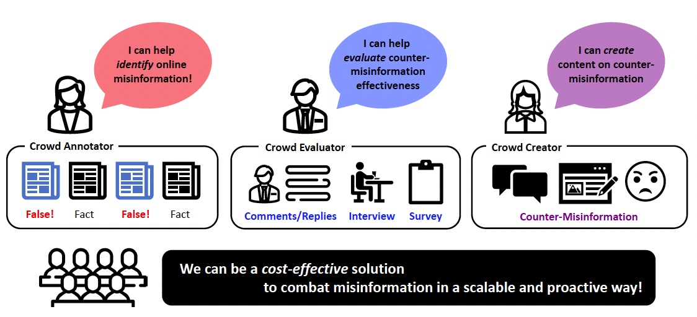
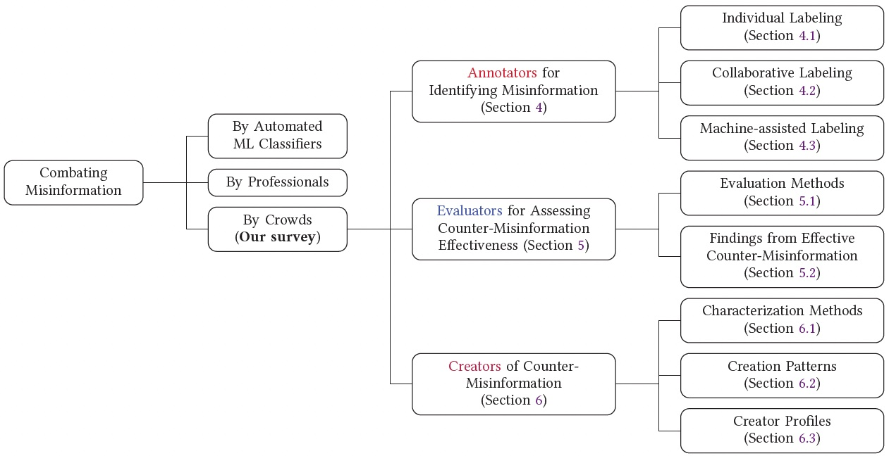

# A Survey on the Role of Crowds in Combating Online Misinformation: Annotators, Evaluators, and Creators

A curated list of papers on "A Survey on the Role of Crowds in Combating Online Misinformation: Annotators, Evaluators, and Creators" ([Paper link](https://arxiv.org/abs/XXX))

Online misinformation poses a global risk with significant real-world consequences. To combat misinformation, current research relies on professionals like journalists and fact-checkers for annotating and debunking false information, while also developing automated machine learning methods for detecting misinformation. Complementary to these approaches, recent research has increasingly concentrated on utilizing the power of ordinary social media users, a.k.a. “the crowd”, who act as eyes-on-the-ground proactively questioning and countering misinformation. Notably, recent studies show that 96% of counter-misinformation responses originate from them. Acknowledging their prominent role, we present the first systematic and comprehensive survey of research papers that actively leverage the crowds to combat misinformation. 

In this survey, we first identify 88 papers related to crowd-based efforts, following a meticulous annotation process adhering to the PRISMA framework (preferred reporting items for systematic reviews and meta-analyses). We then present key statistics related to misinformation, counter-misinformation, and crowd input in different formats and topics. Upon holistic analysis of the papers, we introduce a novel taxonomy of the roles played by the crowds in combating misinformation: (i) crowds as annotators who actively identify misinformation; (ii) crowds as evaluators who assess counter-misinformation effectiveness; (iii) crowds as creators who create counter-misinformation. 
  

This taxonomy explores the crowd’s capabilities in misinformation detection, identifies the prerequisites for effective counter-misinformation, and analyzes crowd-generated counter-misinformation. In each assigned role, we conduct a detailed analysis to categorize the specific utilization of the crowd. Particularly, we delve into (i) distinguishing individual, collaborative, and machine-assisted labeling for annotators; (ii) analyzing the effectiveness of counter-misinformation through surveys, interviews, and in-lab experiments for evaluators; and (iii) characterizing creation patterns and creator profiles for creators. Finally, we conclude this survey by outlining potential avenues for future research in this field.

## References

## 2022
| Title                                                                                                                                                       | Category   |   Year | Venue                                                                                          | Publisher                                            | URL                                                                  |
|:------------------------------------------------------------------------------------------------------------------------------------------------------------|:-----------|-------:|:-----------------------------------------------------------------------------------------------|:-----------------------------------------------------|:---------------------------------------------------------------------|
| Does Evidence from Peers Help Crowd Workers in Assessing Truthfulness?                                                                                      | Annotator  |   2022 | WWW 2022 - Companion Proceedings of the Web Conference 2022                                    | Association for Computing Machinery, Inc             | https://www.doi.org/10.1145/3487553.3524236                          |
| Birds of a feather don't fact-check each other: Partisanship and the evaluation of news in Twitter's Birdwatch crowdsourced fact-checking program           | Annotator  |   2022 | Conference on Human Factors in Computing Systems - Proceedings                                 | Association for Computing Machinery                  | https://www.doi.org/10.1145/3491102.3502040                          |
| Crowd Sourcing and Blockchain-Based Incentive Mechanism to Combat Fake News                                                                                 | Annotator  |   2022 | Studies in Computational Intelligence                                                          | Springer Science and Business Media Deutschland GmbH | https://www.doi.org/10.1007/978-3-030-90087-8_15                     |
| Social Debunking of Misinformation on WhatsApp: The Case for Strong and In-group Ties                                                                       | Evaluator  |   2022 | Proceedings of the ACM on Human-Computer Interaction                                           | Association for Computing Machinery                  | https://www.doi.org/10.1145/3512964                                  |
| Election Fraud and Misinformation on Twitter: Author, Cluster, and Message Antecedents                                                                      | Evaluator  |   2022 | Media and Communication                                                                        | Cogitatio Press                                      | https://www.doi.org/10.17645/mac.v10i2.5168                          |
| Debunking health myths on the internet: the persuasive effect of (visual) online communication                                                              | Evaluator  |   2022 | Journal of Public Health (Germany)                                                             | Springer Science and Business Media Deutschland GmbH | https://www.doi.org/10.1007/s10389-022-01694-3                       |
| A comparison of prebunking and debunking interventions for implied versus explicit misinformation                                                           | Evaluator  |   2022 | British Journal of Psychology                                                                  | nan                                                  | https://pubmed.ncbi.nlm.nih.gov/34967004/                            |
| The effects of self-generated and other-generated eWOM in inoculating against misinformation                                                                | Evaluator  |   2022 | Telematics and Informatics                                                                     | Elsevier Ltd                                         | https://www.doi.org/10.1016/j.tele.2022.101835                       |
| Does Wording Matter? Examining the Effect of Phrasing on Memory for Negated Political Fact Checks                                                           | Evaluator  |   2022 | Journal of Applied Research in Memory and Cognition                                            | Society for Applied Research in Memory and Cognition | https://www.doi.org/10.1037/mac0000022                               |
| Effects of corrections on COVID-19-related misinformation: cross-media empirical analyses in Japan                                                          | Evaluator  |   2022 | International Journal of Web Based Communities                                                 | Inderscience Publishers                              | https://www.doi.org/10.1504/IJWBC.2022.122389                        |
| Factors influencing fake news rebuttal acceptance during the COVID-19 pandemic and the moderating effect of cognitive ability                               | Evaluator  |   2022 | Computers in Human Behavior                                                                    | Elsevier Ltd                                         | https://www.doi.org/10.1016/j.chb.2021.107174                        |
| The Influence of Media Trust and Normative Role Expectations on the Credibility of Fact Checkers                                                            | Evaluator  |   2022 | Journalism Practice                                                                            | Routledge                                            | https://www.doi.org/10.1080/17512786.2022.2080102                    |
| What If Unmotivated Is More Dangerous? The Motivation-Contingent Effectiveness of Misinformation Correction on Social Media                                 | Evaluator  |   2022 | International Journal of Communication                                                         | University of Southern California                    | https://ijoc.org/index.php/ijoc/article/view/17510                   |
| Correcting science misinformation in an authoritarian country: An experiment from China                                                                     | Evaluator  |   2022 | Telematics and Informatics                                                                     | Elsevier Ltd                                         | https://www.doi.org/10.1016/j.tele.2021.101749                       |
| Science Factionalism: How Group Identity Language Affects Public Engagement With Misinformation and Debunking Narratives on a Popular Q&A Platform in China | Creator    |   2022 | Social Media and Society                                                                       | SAGE Publications Ltd                                | https://www.doi.org/10.1177/20563051221077019                        |
| Exploring the Effect of Spreading Fake News Debunking Based on Social Relationship Networks                                                                 | Creator    |   2022 | Frontiers in Physics                                                                           | Frontiers Media S.A.                                 | https://www.doi.org/10.3389/fphy.2022.833385                         |
| The impact of psycholinguistic patterns in discriminating between fake news spreaders and fact checkers                                                     | Creator    |   2022 | Data and Knowledge Engineering                                                                 | Elsevier B.V.                                        | https://www.doi.org/10.1016/j.datak.2021.101960                      |
| Reading between the lies: A classification scheme of types of reply to misinformation in public discussion threads                                          | Creator    |   2022 | CHIIR 2022 - Proceedings of the 2022 Conference on Human Information Interaction and Retrieval | Association for Computing Machinery, Inc             | https://www.doi.org/10.1145/3498366.3505823                          |
| Investigation of the determinants for misinformation correction effectiveness on social media during COVID-19 pandemic                                      | Creator    |   2022 | Information Processing and Management                                                          | Elsevier Ltd                                         | https://www.doi.org/10.1016/j.ipm.2022.102935                        |
| The use of emotions in conspiracy and debunking videos to engage publics on YouTube                                                                         | Creator    |   2022 | New Media and Society                                                                          | SAGE Publications Ltd                                | https://www.doi.org/10.1177/14614448221105877                        |
| Let's fight the infodemic: the third-person effect process of misinformation during public health emergencies                                               | Creator    |   2022 | Internet Research                                                                              | Emerald Group Holdings Ltd.                          | https://www.doi.org/10.1108/INTR-03-2021-0194                        |
| Taking corrective action when exposed to fake news: The role of fake news literacy                                                                          | Creator    |   2022 | Journal of Media Literacy Education                                                            | National Association for Media Literacy Education    | https://www.doi.org/10.23860/JMLE-2022-14-2-1                        |
| COVID-19 Vaccine Fact-Checking Posts on Facebook: Observational Study                                                                                       | Creator    |   2022 | Journal of Medical Internet Research                                                           | JMIR Publications Inc.                               | https://www.doi.org/10.2196/38423                                    |
| The Disinformation Warfare: How users use every means possible in the political battlefield on social media                                                 | Creator    |   2022 | Online Information Review                                                                      | nan                                                  | https://www.emerald.com/insight/content/doi/10.1108/OIR-05-2020-0197 |
| Collective social correction: addressing misinformation through group practices of information verification on WhatsApp                                     | Creator    |   2022 | Digital Journalism                                                                             | Taylor \& Francis                                    | https://www.tandfonline.com/doi/full/10.1080/21670811.2021.1972020   |

## 2021
| Title                                                                                                                                                | Category   |   Year | Venue                                                                                                                     | Publisher                                            | URL                                               |
|:-----------------------------------------------------------------------------------------------------------------------------------------------------|:-----------|-------:|:--------------------------------------------------------------------------------------------------------------------------|:-----------------------------------------------------|:--------------------------------------------------|
| HawkEye: A robust reputation system for community-based counter-misinformation                                                                       | Annotator  |   2021 | Proceedings of the 2021 IEEE/ACM International Conference on Advances in Social Networks Analysis and Mining, ASONAM 2021 | Association for Computing Machinery, Inc             | https://www.doi.org/10.1145/3487351.3488343       |
| Can the crowd judge truthfulness? A longitudinal study on recent misinformation about COVID-19                                                       | Annotator  |   2021 | Personal and Ubiquitous Computing                                                                                         | Springer Science and Business Media Deutschland GmbH | https://www.doi.org/10.1007/s00779-021-01604-6    |
| The many dimensions of truthfulness: Crowdsourcing misinformation assessments on a multidimensional scale                                            | Annotator  |   2021 | Information Processing and Management                                                                                     | Elsevier Ltd                                         | https://www.doi.org/10.1016/j.ipm.2021.102710     |
| ‘It infuriates me': examining young adults’ reactions to and recommendations to fight misinformation about COVID-19                                  | Evaluator  |   2021 | Journal of Youth Studies                                                                                                  | Routledge                                            | https://www.doi.org/10.1080/13676261.2021.1965108 |
| The Effects of a News Literacy Video and Real-Time Corrections to Video Misinformation Related to Sunscreen and Skin Cancer                          | Evaluator  |   2021 | Health Communication                                                                                                      | Routledge                                            | https://www.doi.org/10.1080/10410236.2021.1910165 |
| Scaling up fact-checking using the wisdom of crowds                                                                                                  | Evaluator  |   2021 | Science Advances                                                                                                          | American Association for the Advancement of Science  | https://www.doi.org/10.1126/sciadv.abf4393        |
| You’re definitely wrong, maybe: Correction style has minimal effect on corrections of misinformation online                                          | Evaluator  |   2021 | Media and Communication                                                                                                   | Cogitatio Press                                      | https://www.doi.org/10.17645/mac.v9i1.3519        |
| The Role of Influence of Presumed Influence and Anticipated Guilt in Evoking Social Correction of COVID-19 Misinformation                            | Evaluator  |   2021 | Health Communication                                                                                                      | Routledge                                            | https://www.doi.org/10.1080/10410236.2021.1888452 |
| Evaluating Rumor Debunking Effectiveness During the COVID-19 Pandemic Crisis: Utilizing User Stance in Comments on Sina Weibo                        | Evaluator  |   2021 | Frontiers in Public Health                                                                                                | Frontiers Media S.A.                                 | https://www.doi.org/10.3389/fpubh.2021.770111     |
| Why do citizens share covid‐19 fact‐checks posted by chinese government social media accounts? The elaboration likelihood model                      | Evaluator  |   2021 | International Journal of Environmental Research and Public Health                                                         | MDPI                                                 | https://www.doi.org/10.3390/ijerph181910058       |
| Prevalence of anger, engaged in sadness: engagement in misinformation, correction, and emotional tweets during mass shootings                        | Creator    |   2021 | Online Information Review                                                                                                 | Emerald Group Holdings Ltd.                          | https://www.doi.org/10.1108/OIR-03-2021-0121      |
| Young Adults' Ability To Detect Fake News And Their New Media Literacy Level In The Wake Of The Covid-19 Pandemic                                    | Creator    |   2021 | Journal of Content, Community and Communication                                                                           | nan                                                  | https://www.amity.edu/gwalior/jccc/pdf/jun_31.pdf |
| Arresting fake news sharing on social media: a theory of planned behavior approach                                                                   | Creator    |   2021 | Management Research Review                                                                                                | Emerald Group Holdings Ltd.                          | https://www.doi.org/10.1108/MRR-05-2020-0286      |
| "There is No Corona; It’s a Conspiracy": Addressing the Perceptions of People about COVID-19 through the Narrative of Their Comments on Social Media | Creator    |   2021 | Journal of Consumer Health on the Internet                                                                                | Routledge                                            | https://www.doi.org/10.1080/15398285.2020.1867412 |
| Raising the flag: Monitoring user perceived disinformation on reddit                                                                                 | Creator    |   2021 | Information (Switzerland)                                                                                                 | MDPI AG                                              | https://www.doi.org/10.3390/info12010004          |
| SAMS: Human-in-the-loop approach to combat the sharing of digital misinformation                                                                     | Creator    |   2021 | CEUR Workshop Proceedings                                                                                                 | CEUR-WS                                              | https://arodes.hes-so.ch/record/8922              |
| Fighting disaster misinformation in Latin America: the #19S Mexican earthquake case study                                                            | Creator    |   2021 | Personal and Ubiquitous Computing                                                                                         | Springer Science and Business Media Deutschland GmbH | https://www.doi.org/10.1007/s00779-020-01411-5    |
| Dynamics of social corrections to peers sharing COVID-19 misinformation on WhatsApp in Brazil                                                        | Creator    |   2021 | Journal of the American Medical Informatics Association : JAMIA                                                           | NLM (Medline)                                        | https://www.doi.org/10.1093/jamia/ocab219         |

## 2020
| Title                                                                                                                                                                                    | Category   |   Year | Venue                                                                           | Publisher                                              | URL                                                            |
|:-----------------------------------------------------------------------------------------------------------------------------------------------------------------------------------------|:-----------|-------:|:--------------------------------------------------------------------------------|:-------------------------------------------------------|:---------------------------------------------------------------|
| Investigating Differences in Crowdsourced News Credibility Assessment: Raters, Tasks, and Expert Criteria                                                                                | Annotator  |   2020 | Proceedings of the ACM on Human-Computer Interaction                            | Association for Computing Machinery                    | https://www.doi.org/10.1145/3415164                            |
| WhistleBlower: Towards A Decentralized and Open Platform for Spotting Fake News                                                                                                          | Annotator  |   2020 | Proceedings - 2020 IEEE International Conference on Blockchain, Blockchain 2020 | Institute of Electrical and Electronics Engineers Inc. | https://www.doi.org/10.1109/Blockchain50366.2020.00026         |
| A reliable weighting scheme for the aggregation of crowd intelligence to detect fake news                                                                                                | Annotator  |   2020 | Information (Switzerland)                                                       | MDPI AG                                                | https://www.doi.org/10.3390/INFO11060319                       |
| “Is It the Message or the Messenger?”: Conspiracy Endorsement and Media Sources                                                                                                          | Evaluator  |   2020 | Social Science Computer Review                                                  | SAGE Publications Inc.                                 | https://www.doi.org/10.1177/0894439320965107                   |
| Seeking Formula for Misinformation Treatment in Public Health Crises: The Effects of Corrective Information Type and Source                                                              | Evaluator  |   2020 | Health Communication                                                            | Routledge                                              | https://www.doi.org/10.1080/10410236.2019.1573295              |
| Exploring “Angry” and “Like” Reactions on Uncivil Facebook Comments That Correct Misinformation in the News                                                                              | Evaluator  |   2020 | Digital Journalism                                                              | Routledge                                              | https://www.doi.org/10.1080/21670811.2020.1835512              |
| An Eye Tracking Approach to Understanding Misinformation and Correction Strategies on Social Media: The Mediating Role of Attention and Credibility to Reduce HPV Vaccine Misperceptions | Evaluator  |   2020 | Health Communication                                                            | Routledge                                              | https://www.doi.org/10.1080/10410236.2020.1787933              |
| Feeling angry: the effects of vaccine misinformation and refutational messages on negative emotions and vaccination attitude                                                             | Evaluator  |   2020 | Journal of Health Communication                                                 | Bellwether Publishing, Ltd.                            | https://www.doi.org/10.1080/10810730.2020.1838671              |
| Countering Fake News: A Comparison of Possible Solutions Regarding User Acceptance and Effectiveness                                                                                     | Evaluator  |   2020 | Proceedings of the ACM on Human-Computer Interaction                            | Association for Computing Machinery                    | https://www.doi.org/10.1145/3415211                            |
| Caution: Rumors ahead—A case study on the debunking of false information on Twitter                                                                                                      | Evaluator  |   2020 | Big Data and Society                                                            | SAGE Publications Ltd                                  | https://www.doi.org/10.1177/2053951720980127                   |
| The Battle is On: Factors that Motivate People to Combat Anti-Vaccine Misinformation                                                                                                     | Creator    |   2020 | Health Communication                                                            | Routledge                                              | https://www.doi.org/10.1080/10410236.2020.1838108              |
| Information literacy competence in curtailing fake news about the COVID-19 pandemic among undergraduates in Nigeria                                                                      | Creator    |   2020 | Reference Services Review                                                       | Emerald Group Holdings Ltd.                            | https://www.doi.org/10.1108/RSR-06-2020-0037                   |
| To correct or not to correct? Social identity threats increase willingness to denounce fake news through presumed media influence and hostile media perceptions                          | Creator    |   2020 | Communication Research Reports                                                  | Routledge                                              | https://www.doi.org/10.1080/08824096.2020.1841622              |
| The Role of the Crowd in Countering Misinformation: A Case Study of the COVID-19 Infodemic                                                                                               | Creator    |   2020 | Proceedings - 2020 IEEE International Conference on Big Data, Big Data 2020     | Institute of Electrical and Electronics Engineers Inc. | https://www.doi.org/10.1109/BigData50022.2020.9377956          |
| COVID-19 and the 5G conspiracy theory: Social network analysis of twitter data                                                                                                           | Creator    |   2020 | Journal of Medical Internet Research                                            | JMIR Publications Inc.                                 | https://www.doi.org/10.2196/19458                              |
| Misinformation debunking and cross-platform information sharing through Twitter during Hurricanes Harvey and Irma: a case study on shelters and ID checks                                | Creator    |   2020 | Natural Hazards                                                                 | Springer                                               | https://www.doi.org/10.1007/s11069-020-04016-6                 |
| Characterizing COVID-19 misinformation communities using a novel twitter dataset                                                                                                         | Creator    |   2020 | CEUR Workshop Proceedings                                                       | CEUR-WS                                                | https://arxiv.org/abs/2008.00791                               |
| Refuting fake news on social media: nonprofits, crisis response strategies and issue involvement                                                                                         | Creator    |   2020 | Journal of Product and Brand Management                                         | Emerald Group Holdings Ltd.                            | https://www.doi.org/10.1108/JPBM-12-2018-2146                  |
| Social media rumor refuter feature analysis and crowd identification based on XG Boost and NLP                                                                                           | Creator    |   2020 | Applied Sciences (Switzerland)                                                  | MDPI AG                                                | https://www.doi.org/10.3390/app10144711                        |
| #Arson Emergency and Australia’s “Black Summer”: Polarisation and Misinformation on Social Media                                                                                         | Creator    |   2020 | Disinformation in Open Online Media                                             | Springer                                               | https://link.springer.com/chapter/10.1007/978-3-030-61841-4_11 |

## 2019
| Title                                                                                                                                                                | Category   |   Year | Venue                                                                                                                        | Publisher                                | URL                                               |
|:---------------------------------------------------------------------------------------------------------------------------------------------------------------------|:-----------|-------:|:-----------------------------------------------------------------------------------------------------------------------------|:-----------------------------------------|:--------------------------------------------------|
| Exposure to Countering Messages Online: Alleviating or Strengthening False Belief?                                                                                   | Evaluator  |   2019 | Cyberpsychology, Behavior, and Social Networking                                                                             | Mary Ann Liebert Inc.                    | https://www.doi.org/10.1089/cyber.2019.0227       |
| Fighting misinformation on social media using crowdsourced judgments of news source quality                                                                          | Evaluator  |   2019 | Proceedings of the National Academy of Sciences of the United States of America                                              | National Academy of Sciences             | https://www.doi.org/10.1073/pnas.1806781116       |
| Temporal trends in anti-vaccine discourse on Twitter                                                                                                                 | Creator    |   2019 | Vaccine                                                                                                                      | Elsevier Ltd                             | https://www.doi.org/10.1016/j.vaccine.2019.06.086 |
| Learning from fact-checkers: Analysis and generation of fact-checking language                                                                                       | Creator    |   2019 | SIGIR 2019 - Proceedings of the 42nd International ACM SIGIR Conference on Research and Development in Information Retrieval | Association for Computing Machinery, Inc | https://www.doi.org/10.1145/3331184.3331248       |
| Is citizen journalism better than professional journalism for fact-checking rumours in China? How Weibo users verified information following the 2015 Tianjin blasts | Creator    |   2019 | Global Media and China                                                                                                       | SAGE Publications Ltd                    | https://www.doi.org/10.1177/2059436419834124      |
| Diffusion of pro- and anti-false information tweets: the Black Panther movie case                                                                                    | Creator    |   2019 | Computational and Mathematical Organization Theory                                                                           | Springer New York LLC                    | https://www.doi.org/10.1007/s10588-018-09286-x    |
| Different faces of false: The spread and curtailment of false information in the black Panther Twitter discussion                                                    | Creator    |   2019 | Journal of Data and Information Quality                                                                                      | Association for Computing Machinery      | https://www.doi.org/10.1145/3339468               |
| Debunking rumors on social media: The use of denials                                                                                                                 | Creator    |   2019 | Computers in Human Behavior                                                                                                  | Elsevier Ltd                             | https://www.doi.org/10.1016/j.chb.2019.02.022     |

## 2018
| Title                                                                                                  | Category   |   Year | Venue                                                                                             | Publisher                                              | URL                                               |
|:-------------------------------------------------------------------------------------------------------|:-----------|-------:|:--------------------------------------------------------------------------------------------------|:-------------------------------------------------------|:--------------------------------------------------|
| Hybrid machine-crowd approach for fake news detection                                                  | Annotator  |   2018 | Proceedings - 4th IEEE International Conference on Collaboration and Internet Computing, CIC 2018 | Institute of Electrical and Electronics Engineers Inc. | https://www.doi.org/10.1109/CIC.2018.00048        |
| See Something, Say Something: Correction of Global Health Misinformation on Social Media               | Evaluator  |   2018 | Health Communication                                                                              | Routledge                                              | https://www.doi.org/10.1080/10410236.2017.1331312 |
| Salient beliefs about sharing rumor denials on the Internet                                            | Creator    |   2018 | ACM International Conference Proceeding Series                                                    | Association for Computing Machinery                    | https://www.doi.org/10.1145/3164541.3164578       |
| Rumor response, debunking response, and decision makings of misinformed Twitter users during disasters | Creator    |   2018 | Natural Hazards                                                                                   | Springer Netherlands                                   | https://www.doi.org/10.1007/s11069-018-3344-6     |

## 2017
| Title                                                                              | Category   |   Year | Venue                                                                                                                                | Publisher                           | URL                                              |
|:-----------------------------------------------------------------------------------|:-----------|-------:|:-------------------------------------------------------------------------------------------------------------------------------------|:------------------------------------|:-------------------------------------------------|
| An analysis of rumor and counter-rumor messages in social media                    | Annotator  |   2017 | Lecture Notes in Computer Science (including subseries Lecture Notes in Artificial Intelligence and Lecture Notes in Bioinformatics) | Springer Verlag                     | https://www.doi.org/10.1007/978-3-319-70232-2_22 |
| The Retransmission of Rumor and Rumor Correction Messages on Twitter               | Creator    |   2017 | American Behavioral Scientist                                                                                                        | SAGE Publications Inc.              | https://www.doi.org/10.1177/0002764217717561     |
| A study of tweet veracity to separate rumours from counter-rumours                 | Creator    |   2017 | ACM International Conference Proceeding Series                                                                                       | Association for Computing Machinery | https://www.doi.org/10.1145/3097286.3097290      |
| A closer look at the self-correcting crowd: Examining corrections in online rumors | Creator    |   2017 | Proceedings of the ACM Conference on Computer Supported Cooperative Work, CSCW                                                       | Association for Computing Machinery | https://www.doi.org/10.1145/2998181.2998294      |
| Does KFC sell rat? Analysis of tweets in the wake of a rumor outbreak              | Creator    |   2017 | Aslib Journal of Information Management                                                                                              | Emerald Group Publishing Ltd.       | https://www.doi.org/10.1108/AJIM-01-2017-0026    |

## 2016
| Title                                                                                                  | Category   |   Year | Venue                                                                                                                     | Publisher                                              | URL                                              |
|:-------------------------------------------------------------------------------------------------------|:-----------|-------:|:--------------------------------------------------------------------------------------------------------------------------|:-------------------------------------------------------|:-------------------------------------------------|
| Changing conspiracy beliefs through rationality and ridiculing                                         | Evaluator  |   2016 | Frontiers in Psychology                                                                                                   | Frontiers Research Foundation                          | https://www.doi.org/10.3389/fpsyg.2016.01525     |
| Analysing how people orient to and spread rumours in social media by looking at conversational threads | Creator    |   2016 | PLoS ONE                                                                                                                  | Public Library of Science                              | https://www.doi.org/10.1371/journal.pone.0150989 |
| An exploration of rumor combating behavior on social media in the context of social crises             | Creator    |   2016 | Computers in Human Behavior                                                                                               | Elsevier Ltd                                           | https://www.doi.org/10.1016/j.chb.2015.11.054    |
| Toward understanding how users respond to rumours in social media                                      | Creator    |   2016 | Proceedings of the 2016 IEEE/ACM International Conference on Advances in Social Networks Analysis and Mining, ASONAM 2016 | Institute of Electrical and Electronics Engineers Inc. | https://www.doi.org/10.1109/ASONAM.2016.7752326  |

## 2015
| Title                                                                               | Category   |   Year | Venue                                                                                   | Publisher                                | URL                                                     |
|:------------------------------------------------------------------------------------|:-----------|-------:|:----------------------------------------------------------------------------------------|:-----------------------------------------|:--------------------------------------------------------|
| CREDBANK: A large-scale social media corpus with associated credibility annotations | Annotator  |   2015 | Proceedings of the 9th International Conference on Web and Social Media, ICWSM 2015     | AAAI Press                               | https://ojs.aaai.org/index.php/ICWSM/article/view/14625 |
| Reducing conspiracy theory beliefs                                                  | Evaluator  |   2015 | Psihologija                                                                             | Serbian Psychological Society            | https://www.doi.org/10.2298/PSI1503251S                 |
| Crowdsourced rumour identification during emergencies                               | Evaluator  |   2015 | WWW 2015 Companion - Proceedings of the 24th International Conference on World Wide Web | Association for Computing Machinery, Inc | https://www.doi.org/10.1145/2740908.2742573             |

## 2013
| Title                                                                     | Category   |   Year | Venue                                          |   Publisher | URL                                         |
|:--------------------------------------------------------------------------|:-----------|-------:|:-----------------------------------------------|------------:|:--------------------------------------------|
| Analysis of microblog rumors and correction texts for disaster situations | Creator    |   2013 | ACM International Conference Proceeding Series |         nan | https://www.doi.org/10.1145/2539150.2539184 |